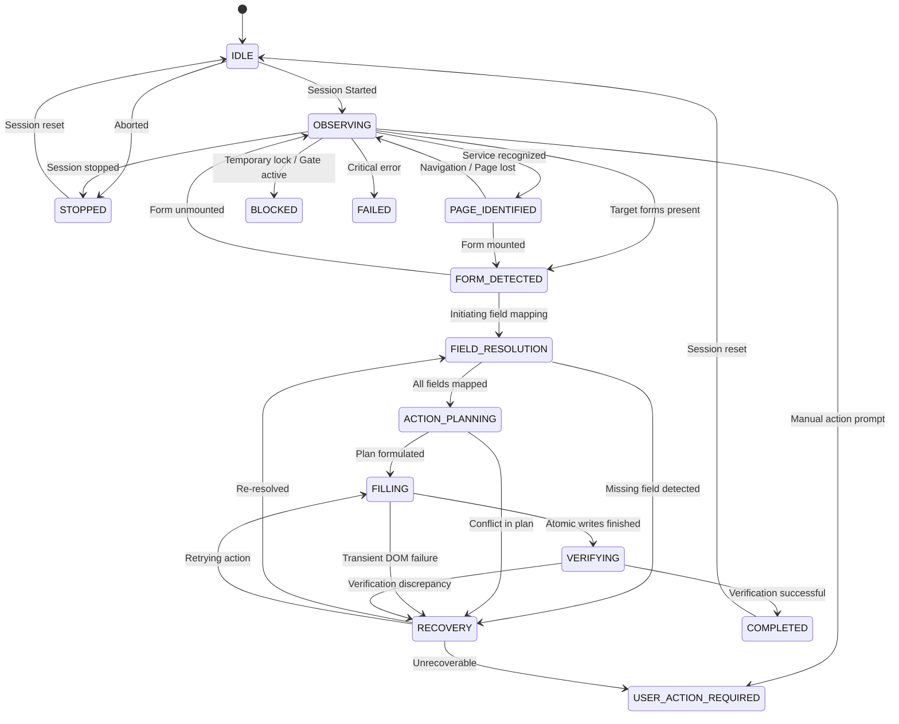

# Tirumala SevaPilot — Automation State Machine (Phase 11)

## State Specifications

The Automation State Machine strictly governs all automated operations within content scripts.

## State Descriptions

| State | Purpose | Next Allowed States |
|---|---|---|
| `IDLE` | Waiting for session initialization | `OBSERVING`, `STOPPED` |
| `OBSERVING` | Actively monitoring DOM for forms & services | `PAGE_IDENTIFIED`, `FORM_DETECTED`, `USER_ACTION_REQUIRED`, `BLOCKED`, `STOPPED`, `FAILED` |
| `PAGE_IDENTIFIED` | Target TTD service recognized | `FORM_DETECTED`, `OBSERVING`, `USER_ACTION_REQUIRED`, `BLOCKED`, `STOPPED`, `FAILED` |
| `FORM_DETECTED` | Valid devotee form container mounted | `FIELD_RESOLUTION`, `OBSERVING`, `USER_ACTION_REQUIRED`, `BLOCKED`, `STOPPED`, `FAILED` |
| `FIELD_RESOLUTION` | Mapping devotee profile fields to DOM inputs | `ACTION_PLANNING`, `RECOVERY`, `USER_ACTION_REQUIRED`, `BLOCKED`, `STOPPED`, `FAILED` |
| `ACTION_PLANNING` | Generating differential fill instructions | `FILLING`, `RECOVERY`, `USER_ACTION_REQUIRED`, `BLOCKED`, `STOPPED`, `FAILED` |
| `FILLING` | Executing atomic DOM inputs with synthetic events | `VERIFYING`, `RECOVERY`, `USER_ACTION_REQUIRED`, `BLOCKED`, `STOPPED`, `FAILED` |
| `VERIFYING` | Validating values against live DOM state | `COMPLETED`, `RECOVERY`, `USER_ACTION_REQUIRED`, `BLOCKED`, `STOPPED`, `FAILED` |
| `RECOVERY` | Self-healing transient DOM churn or replacements | `FIELD_RESOLUTION`, `FILLING`, `ACTION_PLANNING`, `USER_ACTION_REQUIRED`, `BLOCKED`, `STOPPED`, `FAILED` |
| `USER_ACTION_REQUIRED` | Devotee intervention required (CAPTCHA, OTP, etc.) | `OBSERVING`, `FIELD_RESOLUTION`, `STOPPED`, `COMPLETED`, `FAILED` |
| `BLOCKED` | Server hold or gate active (Temporary Lock) | `OBSERVING`, `STOPPED`, `FAILED` |
| `STOPPED` | Gracefully aborted or stopped by user | `IDLE`, `OBSERVING` |
| `COMPLETED` | Successful autofill and verification | `IDLE`, `OBSERVING` |
| `FAILED` | Terminal unrecoverable error | `IDLE`, `OBSERVING`, `RECOVERY`, `STOPPED` |

## Transition Invariance
Calling `transition(nextState)` enforces validation against `VALID_AUTOMATION_TRANSITIONS`. Attempting an undeclared jump (e.g. `IDLE -> FILLING`) immediately throws an error and prevents undefined state transitions.
