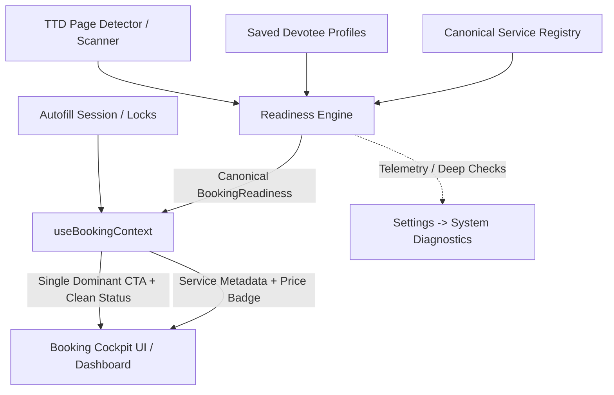

# Phase 2 — Booking Cockpit / Premium Home UX

**Repository:** [tirumala-sevapilot](https://github.com/chiru80/tirumala-sevapilot)  
**Branch:** `phase-2/booking-cockpit`  
**Base:** `master` (Phase 1 Canonical Foundation merged)  
**Status:** COMPLETE & VALIDATED

---

## 1. Executive Summary

Phase 2 transforms the Tirumala SevaPilot Home interface from a diagnostic engineering dashboard into a serene, devotional, high-clarity **TTD Booking Cockpit**.

Prior to Phase 2, devotees were exposed to internal technical readiness percentages (e.g., `80% READY`), check counters (`4 of 6 checks complete`), and DOM mapping states on the primary screen. In high-speed TTD booking situations (such as 10:00 AM quota drops), devotees need instantaneous clarity within 3–5 seconds:
1. **What is my active booking service?**
2. **Am I ready to book right now?**
3. **What is my single next step?**

Phase 2 eliminates all internal diagnostic metrics from the Home UI, moves telemetry to an on-demand **System Diagnostics Inspector** under Settings, and introduces the thin `useBookingContext` adapter hook that resolves exactly **ONE visually dominant CTA** following strict priority rules.

---

## 2. Core Architecture & `useBookingContext`

The Booking Cockpit does **not** compute business logic, readiness rules, or quota limits on its own. It serves strictly as a presentation adapter over Phase 1's authoritative sources of truth:
- [ReadinessEngine.evaluateBookingReadiness()](file:///c:/Users/HP/Desktop/TIRUMALA%20SEVAPILOT/src/services/readiness-engine.ts)
- [getCanonicalService()](file:///c:/Users/HP/Desktop/TIRUMALA%20SEVAPILOT/src/services/canonical-service-registry.ts)
- [getWorkflowById()](file:///c:/Users/HP/Desktop/TIRUMALA%20SEVAPILOT/src/services/workflows/registry.ts)

### Architecture Diagram



### Hook Contract (`useBookingContext`)

Located at [src/sidepanel/hooks/useBookingContext.ts](file:///c:/Users/HP/Desktop/TIRUMALA%20SEVAPILOT/src/sidepanel/hooks/useBookingContext.ts):

```typescript
export type BookingCockpitState =
  | 'TEMPORARY_LOCK'
  | 'FIRST_TIME'
  | 'FILLING'
  | 'REVIEW_READY'
  | 'ACTION_REQUIRED'
  | 'READY'
  | 'NO_TTD_PAGE'
  | 'UNKNOWN';
```

---

## 3. Dominant CTA Priority Order

The Cockpit resolves exactly one primary CTA at any given instant following this strict priority order:

| Priority | State | Dominant Primary CTA | Secondary Action | Supporting / Subtext |
| :---: | :--- | :--- | :--- | :--- |
| **1** | `TEMPORARY_LOCK` | `TRY AGAIN` (non-auto-retry) | `CHECK BOOKING HISTORY` | Informs user of server-side hold without deleting profiles. |
| **2** | `FIRST_TIME` | `CREATE PROFILE` | `Learn how it works` | Warm welcome prompting pilgrim profile creation. |
| **3** | `FILLING` | `FILLING…` (spinner) | `Emergency Stop` button | Safe execution indicator with instant cancellation option. |
| **4** | `REVIEW_READY` | `✓ READY FOR REVIEW` | — | Confirmation that form fields were verified in DOM. |
| **5** | `ACTION_REQUIRED` | `SELECT PILGRIMS` / `COMPLETE PROFILE` | — | Directs devotee to select pilgrims or fill missing required IDs. |
| **6** | `READY` (on TTD) | `⚡ FILL & VERIFY` | — | High-confidence autofill trigger with ₹ price badge. |
| **7** | `NO_TTD_PAGE + READY`| `PREPARE BOOKING` | `OPEN TTD BOOKING ↗` | Allows devotee to review pilgrims while waiting for release. |
| **8** | `UNKNOWN / NO TTD` | `OPEN TTD BOOKING ↗` | — | Opens the official TTD portal. |

---

## 4. Elimination of Diagnostic Clutter & Settings Inspector

### Zero Percentage Clutter on Home
- Percentage metrics (e.g. `80%`) and internal check counts (`4 of 6 checks passed`) have been completely removed from the devotee's cockpit.
- Replaced by clean, reassuring consumer status indicators:
  - `✓ Ready to fill` (Emerald pill)
  - `⚠ Action required` (Amber pill)
  - `Server hold active` (Amber alert banner)

### System Diagnostics in Settings
- Devotees, developers, and QA engineers can inspect operational telemetry on-demand without cluttering the primary workflow.
- Located in [src/sidepanel/pages/Settings.tsx](file:///c:/Users/HP/Desktop/TIRUMALA%20SEVAPILOT/src/sidepanel/pages/Settings.tsx):
  - Dedicated **System Diagnostics** inspector button (`Inspect 🔍`).
  - Launches [DiagnosticModal](file:///c:/Users/HP/Desktop/TIRUMALA%20SEVAPILOT/src/sidepanel/components/dashboard/DiagnosticModal.tsx) displaying:
    - TTD Portal detection state
    - Canonical Service identification & Workflow version
    - Fields detected, fields verified, and confidence telemetry
    - Strictly adheres to the **ZERO-PII POLICY** (no devotee names, numbers, or Aadhaar).

---

## 5. Devotee Trust: 5-Step "How It Works" & Safety Boundaries

[HowItWorksCard.tsx](file:///c:/Users/HP/Desktop/TIRUMALA%20SEVAPILOT/src/sidepanel/components/dashboard/HowItWorksCard.tsx) provides a clear 5-step trust progression:

1. **01 CREATE PROFILE**: Save your pilgrim details once.
2. **02 OPEN TTD & SELECT PILGRIMS**: Open official TTD portal and choose who is travelling.
3. **03 SEVAPILOT CHECKS FORM**: SevaPilot checks the live form safely.
4. **04 FILL & VERIFY**: Fill supported TTD forms and verify the details.
5. **05 YOU STAY IN CONTROL**: Review, OTP, payment, and submission remain 100% yours.

### Dedicated Trust Highlight
```
🛡️ You stay in complete control: SevaPilot never automates CAPTCHA, OTP, or payments. All pilgrim data remains strictly on your computer.
```

Internationalized across all 5 supported languages (`en`, `te`, `hi`, `ta`, `kn`).

---

## 6. Premium Devotional Header & Release Ticker

### Brand Identity
- Header presents:
  - **Tirumala SevaPilot**
  - **TTD Booking Assistant**
  - **Om Namo Venkatesaya**
- Extension version (`v1.1.0`) is kept out of the primary visual hierarchy and available inside Settings.

### Verified Release Ticker & Upcoming Releases
- [ReleaseTicker.tsx](file:///c:/Users/HP/Desktop/TIRUMALA%20SEVAPILOT/src/sidepanel/components/dashboard/ReleaseTicker.tsx) consumes verified official announcements.
- **Zero Fabrication**: Never generates fake dates, times, or countdowns.
- Neutral verified fallback displayed when no upcoming releases are confirmed:
  `TTD RELEASE UPDATE: Release date not announced yet · Official release information will appear here when verified.`
- Expired releases never appear as upcoming.

---

## 7. Verification & Quality Assurance

### Test Suite Execution
- **Unit Test Suite:** [tests/sidepanel/BookingCockpit.test.tsx](file:///c:/Users/HP/Desktop/TIRUMALA%20SEVAPILOT/tests/sidepanel/BookingCockpit.test.tsx) covers all cockpit states, CTA transitions, and settings diagnostic triggers.
- **Regression Suite:** [tests/sidepanel/Dashboard.test.tsx](file:///c:/Users/HP/Desktop/TIRUMALA%20SEVAPILOT/tests/sidepanel/Dashboard.test.tsx) validated for backward compatibility.
- **Full Repository Suite:** 63 test files passing.
- **TypeScript & Bundle:** 0 type errors, clean Vite production build.

```
TypeScript  0 errors (tsc --noEmit)
Vite Build  dist/ built successfully in 7.48s
```

