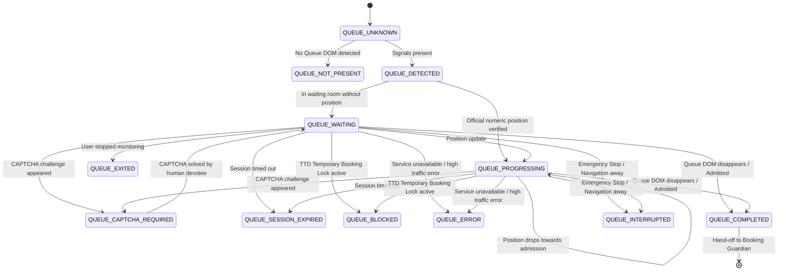

# Tirumala SevaPilot — Queue Intelligence & Safe Waiting (Phase 10)

## Overview & Mission

The **Queue Intelligence** layer provides production-grade awareness of the official TTD Digital Waiting Room (virtual queue). It is designed to comfort and guide the devotee during high-traffic queue waiting while preserving strict security boundaries.

### Hard Safety Constraints (Zero Queue Bypass)

SevaPilot is **NOT** a queue bypass tool. Under no circumstances will SevaPilot:
- Bypass, tamper with, or circumvent the TTD queue.
- Generate, manipulate, clone, replay, or inject queue tokens.
- Forge, spoof, or replay HTTP/WebSocket requests to TTD queue endpoints.
- Artificially manipulate queue position or progress counters.
- Automatically solve CAPTCHAs, enter OTPs, or process payments.
- Automatically refresh the browser tab or execute aggressive polling loops.
- Automatically submit bookings.

The human devotee remains fully in control at every stage.

---

## 1. Canonical Queue State Machine

The queue layer defines 16 canonical states (`src/services/queue/types.ts`):



### State Definitions
1. `QUEUE_UNKNOWN`: Initial state or ambiguous signals.
2. `QUEUE_NOT_PRESENT`: Standard page (no waiting room detected).
3. `QUEUE_DETECTED`: Multiple signals indicate a virtual waiting room.
4. `QUEUE_LOADING`: Queue room DOM is initializing.
5. `QUEUE_WAITING`: Devotee is in the waiting room; position is not explicitly reported.
6. `QUEUE_PROGRESSING`: Official verified queue position is reported and tracking.
7. `QUEUE_ACTION_REQUIRED`: General interaction requested on page.
8. `QUEUE_CAPTCHA_REQUIRED`: Devotee must complete a CAPTCHA challenge manually.
9. `QUEUE_SESSION_WARNING`: Session nearing expiration.
10. `QUEUE_SESSION_EXPIRED`: Session has expired; devotee must re-authenticate manually.
11. `QUEUE_COMPLETED`: Devotee admitted past the queue; page ready for re-evaluation.
12. `QUEUE_ERROR`: Official queue endpoint or page reports a service fault.
13. `QUEUE_BLOCKED`: Server-side Temporary Booking Lock is active (holds precedence).
14. `QUEUE_INTERRUPTED`: Session disconnected, navigated away, or Emergency Stop invoked.
15. `QUEUE_CHANGED`: Route or layout altered during wait.
16. `QUEUE_EXITED`: User explicitly clicked "Stop Monitoring".

---

## 2. Multi-Signal Detection Architecture

Queue detection requires corroboration across multiple independent signals before confirmation. Never rely on a single substring or URL fragment.

1. **Signal A — URL Markers (40 pts)**:
   - Evaluates path and query patterns matching `/queue/`, `/waiting-room/`, `/virtual-queue/`, `/holding/`.
2. **Signal B — Stable DOM Selectors (40 pts)**:
   - Inspects confirmed selectors: `#waitingRoom`, `#queue-it_log`, `[data-testid*="waiting-room"]`, `.queue-container`, `.virtual-queue`, `.waiting-room-container`.
3. **Signal C — Semantic Text Tokens (35 pts)**:
   - Searches visible text for confirmed phrasing: `"virtual waiting room"`, `"you are in line"`, `"queue position"`, `"estimated wait time"`, `"please do not refresh"`, `"high traffic"`.
4. **Confidence Threshold**:
   - Total score $\ge 40$ required to declare queue presence.
   - If confidence is insufficient: returns `QUEUE_NOT_PRESENT` or `QUEUE_UNKNOWN`.

---

## 3. Trust Boundary & Token Safety

All queue-related DOM elements, JavaScript variables, cookies, and network payloads are treated as untrusted.

- **No Code Evaluation**: `eval()` and `new Function()` are strictly prohibited.
- **No Token Modification**: If TTD utilizes a queue token (e.g. `Queue-it` token), SevaPilot **NEVER** reads, captures, tampers with, persists, or replays this token.
- **Zero Token Logging**: Tokens are never saved in local storage, sent to extension UI, or logged in diagnostics.
- **XSS Immunity**: Queue-derived strings are rendered via standard React text nodes (`{progress.position}`), never via `dangerouslySetInnerHTML`.

---

## 4. Truth Boundary: Position & Wait Time Authenticity

SevaPilot adheres to a strict **Truth Boundary**:

- **Official Queue Position**:
  - Extracted only if explicitly and visibly displayed in official DOM (e.g., `"Your position in line: 124"`).
  - Commas are sanitized (e.g., `"1,248"` $\rightarrow$ `1248`).
  - Labelled clearly in UI as `"Official Queue Position: 124"`.
- **Zero Fabricated Positions**:
  - If no position is shown, UI displays: *"TTD is processing your request in the waiting room."*
  - SevaPilot never guesses, estimates, or synthesizes a fake queue position or queue speed.
- **Zero Fabricated Wait Times**:
  - Official wait times (e.g., `"10 minutes"`) are displayed **only** if explicitly rendered by TTD.
  - If TTD does not provide a wait time, none is shown. SevaPilot never displays speculative countdowns or success probabilities.

---

## 5. Priority Boundaries & Safety Precedence

When multiple conditions collide, safety precedence is strictly enforced:

```
1. TEMPORARY BOOKING LOCK (QUEUE_BLOCKED)
   ↓ (Server hold active: holds highest safety precedence)
2. SESSION EXPIRED (QUEUE_SESSION_EXPIRED)
   ↓ (User must re-authenticate manually)
3. CAPTCHA CHALLENGE (QUEUE_CAPTCHA_REQUIRED)
   ↓ (User must solve CAPTCHA manually)
4. ACTIVE QUEUE (QUEUE_WAITING / QUEUE_PROGRESSING)
   ↓ (Safe waiting mode)
5. QUEUE COMPLETED (QUEUE_COMPLETED)
   ↓ (Handoff to Booking Guardian)
```

---

## 6. Safe Waiting Mode & No-Refresh Policy

When entering the queue, the extension enters **Safe Waiting Mode**:

1. **Clear Devotee Guidance**:
   - *"TTD Digital Queue detected"*
   - *"Please keep this TTD page open."*
   - *"Do not refresh unnecessarily — refreshing may reset your queue position."*
   - *"Complete any CAPTCHA manually if prompted."*
2. **Zero Automatic Refresh**:
   - The extension will **never** automatically reload the tab or click refresh buttons.
   - If the queue becomes stale, a manual action button is presented: `[Refresh Manually]`.
3. **Passive Observation Lifecycle**:
   - Employs a debounced (250ms) targeted `MutationObserver` on document body.
   - Conservative 6-second bounded heartbeat fallback.
   - Completely silent: zero network requests sent to TTD.

---

## 7. Transition to Booking Guardian

When the devotee is admitted through the waiting room:

1. **Queue Disappearance**:
   - Queue DOM elements disappear as TTD redirects to booking stages (service selection, slot selection, or devotee details).
2. **Completion Transition**:
   - `QueueManager` transitions to `QUEUE_COMPLETED`.
   - Observers and heartbeat timers are automatically disconnected.
   - Registered completion listeners are triggered.
3. **Re-Evaluation & Guardian Authority**:
   - Control is handed directly to **Booking Guardian**.
   - Booking Guardian executes fresh multi-signal page detection (`detectActiveBookingStage`).
   - SevaPilot does **not** assume booking succeeded; Guardian enforces 10-point preflight validation before any autofill handoff.

---

## 8. Multi-Tab Session Isolation

- Each browser tab running a queue page is assigned an isolated `QueueSession` with a distinct `sessionId` and `tabId`.
- Queue states from Tab A and Tab B are never merged or commingled.
- Background routing ensures messages and actions only operate within the focused tab's scope.

---

## 9. Emergency Stop Protocol

Clicking **Emergency Stop**:
- Immediately disconnects all `MutationObserver` instances.
- Cancels active heartbeat timers and pending debounced checks.
- Marks the session state as `QUEUE_INTERRUPTED`.
- Invalidates internal session state.
- **Safety Guarantee**: Never closes the tab, never forces a page reload, and never modifies TTD page data.

---

## 10. Performance & Resource Cleanup

- **Targeted Observers**: Disconnected immediately upon session exit, completion, page transition, or extension unload.
- **Debounced Processing**: DOM mutations are debounced at 250ms to prevent CPU thrashing during heavy DOM churn.
- **Bounded Timers**: Timers are strictly bounded (6s heartbeat) and cleared on cleanup.
- **Memory Leak Prevention**: All listener sets are cleared and dereferenced upon unmount.
