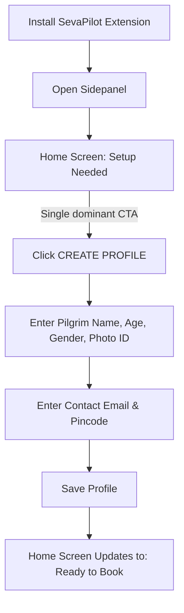
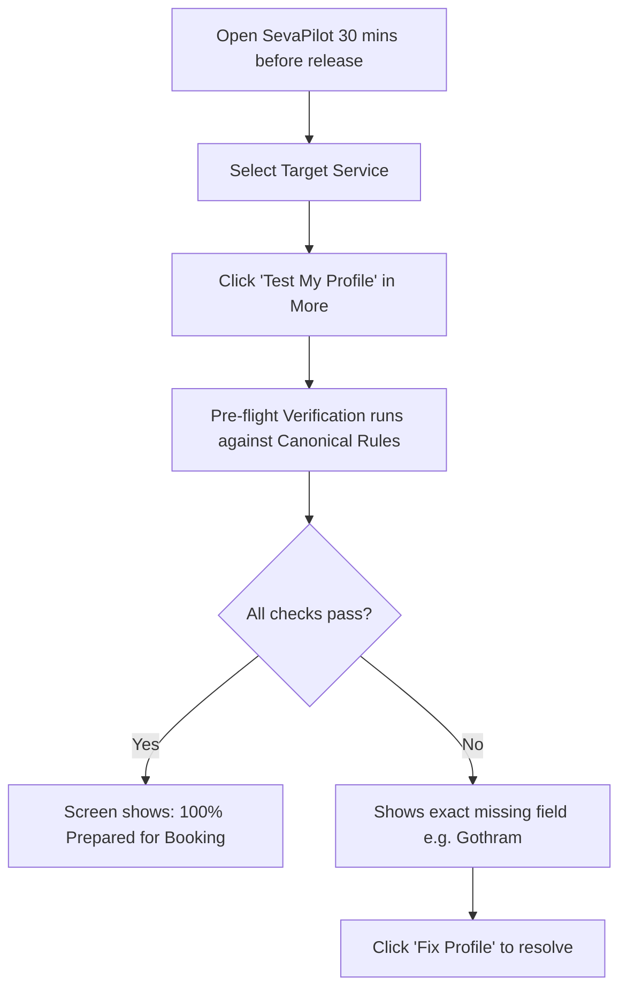
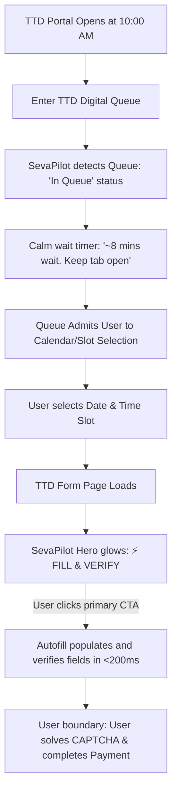
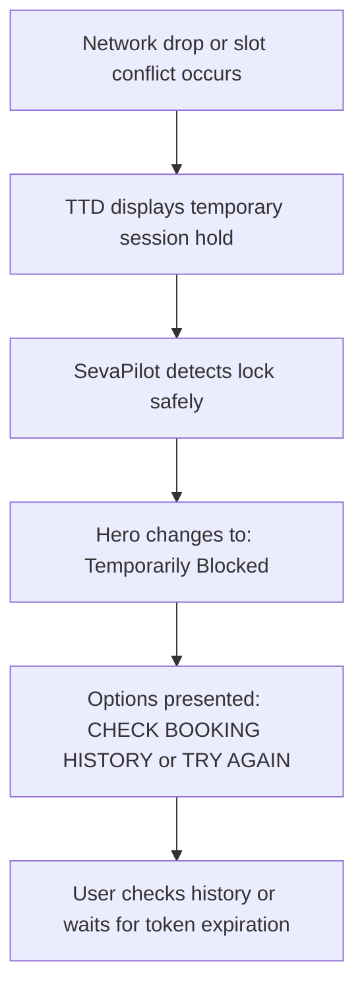

# Tirumala SevaPilot — End-to-End User Journeys (Phase 13)

## Journey 1: First-Time Pilgrim Setup (Zero Frustration)

1. **First Opening**: The user is greeted by a clean Home screen without percentage clutter or diagnostic errors.
2. **Clear Direction**: The hero card clearly states: *"No profile yet. Complete your profile to prepare for fast booking."*
3. **Primary Action**: Clicking the large purple `CREATE PROFILE` button opens the Profile form directly.
4. **Instant Validation**: Verhoeff checksum validates Aadhaar in real-time, preventing typo rejections during live drops.
5. **Immediate Readiness**: Saving returns the user to Home, where the status instantly becomes `Ready to Book`.

---

## Journey 2: Pre-Booking Readiness Verification (The Morning of Quota Drop)

1. **Service Selection**: The user selects their target service (e.g. ₹300 Special Entry Darshan or ₹1600 Homam).
2. **Pre-Flight Test**: User taps `Test My Profile` to verify all requirements against official TTD rules without touching the live portal.
3. **Peace of Mind**: Receives instant confirmation that name formatting, age brackets, photo ID, and service-specific rules are 100% satisfied.

---

## Journey 3: Live Booking Rush (Under High Traffic)

1. **Queue Safety**: User is placed into the TTD virtual queue. SevaPilot enters passive queue monitoring with calm messaging ("Safe queue monitoring active. Do not refresh.").
2. **Admission**: Once admitted, user selects their date and slot.
3. **One-Click Execution**: As soon as the devotee form appears, the hero CTA turns into `⚡ FILL & VERIFY`.
4. **Sub-200ms Population**: SevaPilot populates all pilgrim rows and verifies DOM synchronization.
5. **Human Boundaries**: The user independently solves the CAPTCHA and proceeds to payment, adhering strictly to TTD terms.

---

## Journey 4: Temporary Booking Lock Recovery

1. **No Panic**: When TTD returns a temporary lock ("slot held by another session"), SevaPilot calmly informs the user that TTD holds slot tokens for a short duration.
2. **Clear Alternatives**: Provides a one-click button to check official booking history in case the ticket was already generated, or retry once released.
